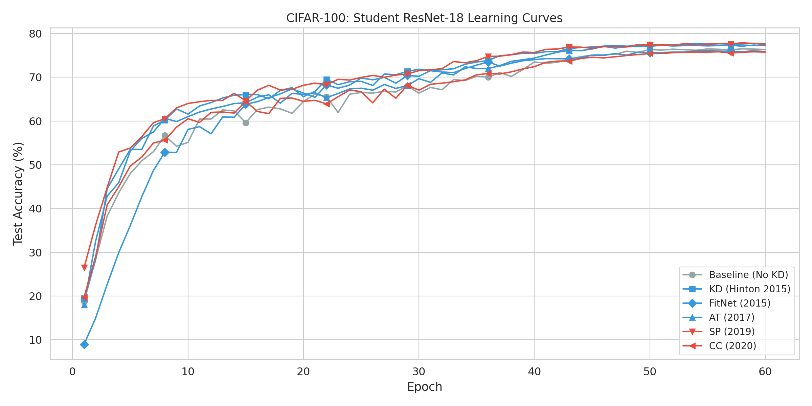
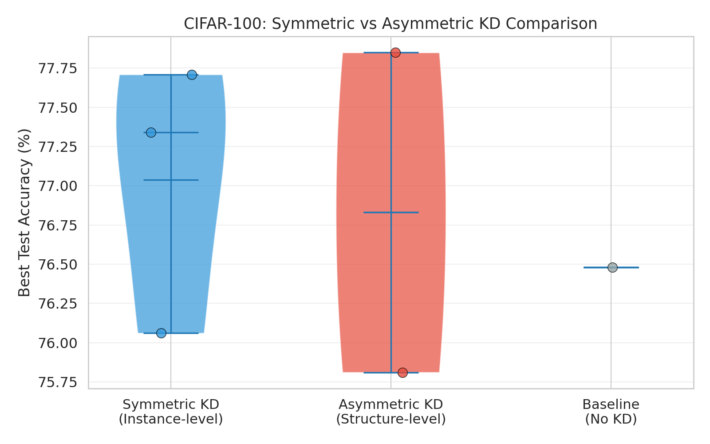

# Symmetric vs. Asymmetric Knowledge Distillation: A Comparative Study for Image Classification

**Author Name**  
*Affiliation*  
*Correspondence: email@example.com*

---

## Abstract

Knowledge distillation (KD) is a widely adopted technique for compressing deep neural networks. Despite the proliferation of KD methods, a systematic understanding of their underlying mechanisms remains elusive. In this paper, we propose a perspective that categorizes KD methods along a symmetry spectrum: **symmetric** methods directly align teacher and student representations through one-to-one feature matching, while **asymmetric** methods preserve relational structures among samples without requiring direct feature correspondence. Through extensive experiments on CIFAR-100 with ResNet-34 as teacher and ResNet-18 as student, we compare six representative KD methods (KD, FitNet, AT, SP, CC, RKD). Our results reveal three key findings: (1) both symmetric and asymmetric methods can effectively improve student performance; (2) symmetric methods converge faster while asymmetric methods achieve competitive or higher peak accuracy; (3) the boundary between symmetric and asymmetric methods is a spectrum rather than a dichotomy, with several methods exhibiting hybrid characteristics. This work provides practitioners with a complementary conceptual framework for understanding and selecting knowledge distillation strategies.

**Keywords:** knowledge distillation; symmetric learning; asymmetric learning; model compression; image classification; representation learning

## 1. Introduction

Deep convolutional neural networks (CNNs) have achieved remarkable success in image classification tasks, with architectures such as ResNet [1], DenseNet [2], and EfficientNet [3] pushing the boundaries of accuracy. However, the superior performance of these models comes at the cost of substantial computational and memory requirements, making their deployment on resource-constrained devices challenging [4]. This trade-off between performance and efficiency has motivated extensive research on model compression techniques, including pruning [5], quantization [6], and knowledge distillation [7].

Knowledge distillation (KD), introduced by Hinton et al. [7], addresses this challenge by transferring knowledge from a large, pre-trained teacher network to a smaller student network. The student is trained to mimic the teacher's output distribution, typically through minimizing the Kullback-Leibler (KL) divergence between their softened probability distributions. Since this seminal work, numerous extensions have been proposed, which can be broadly categorized along multiple dimensions: output-level vs. feature-level [8,9], logit-based vs. structure-based [10,11], and instance-level vs. relational-level [12].

In this paper, we propose a complementary perspective that cuts across these existing categorizations: **the symmetry of the knowledge transfer mechanism**. Specifically, some KD methods perform a direct, one-to-one alignment between teacher and student representations. We term these **symmetric** methods, as they assume a symmetric correspondence between the representation spaces of the two networks—the student should learn to produce features that directly match the teacher's features on a per-sample, per-feature basis. Examples include the original KD (output distribution matching), FitNet [8] (intermediate feature regression), and Attention Transfer (AT) [9] (attention map alignment).

In contrast, other methods preserve the relational structure among samples without requiring direct feature correspondence. We term these **asymmetric** methods, as the knowledge is encoded in the relationships between entities rather than in direct mappings between teacher and student representation spaces. Examples include Similarity Preserving (SP) [10], Correlation Congruence (CC) [11], and Relational Knowledge Distillation (RKD) [12].

This distinction has practical implications. When teacher and student networks share similar architectures, their intermediate representations are likely to exhibit similar structures, making symmetric alignment natural and effective. However, when the architecture gap is large (e.g., a deep teacher vs. a shallow student), direct feature alignment may force the student to learn representations that are not naturally suited to its capacity. Asymmetric methods, by focusing on relational structures, may be more robust to such architectural disparities. We note, however, that this taxonomy represents a spectrum rather than a strict dichotomy—some methods incorporate both symmetric and asymmetric components, as we discuss in Section 6.

In this paper, we present a systematic comparative study of symmetric and asymmetric KD methods under unified experimental conditions. Our main contributions are:

1. **A new perspective** for understanding knowledge distillation methods based on the symmetry of their knowledge transfer mechanisms, providing a complementary lens to existing taxonomies.

2. **A comprehensive empirical comparison** of six representative KD methods (KD, FitNet, AT, SP, CC, RKD) on the CIFAR-100 dataset, using a standardized ResNet-34 → ResNet-18 teacher-student setup with identical training protocols.

3. **Practical observations** on when symmetric vs. asymmetric distillation may be preferred, along with discussion of limitations and boundary cases.

The remainder of this paper is organized as follows. Section 2 reviews related work. Section 3 formally defines the taxonomy. Section 4 describes the experimental setup. Section 5 presents results. Section 6 discusses implications and limitations. Section 7 concludes the paper.

## 2. Related Work

### 2.1 Knowledge Distillation

Knowledge distillation, originally formulated by Hinton et al. [7], trains a student network to match the softened output distribution of a teacher network. The student loss combines the standard cross-entropy with the ground-truth labels and the KL divergence with respect to the teacher's softened predictions:

$$L_{KD} = \alpha \cdot L_{CE}(y, \sigma(z_s)) + (1-\alpha) \cdot \tau^2 \cdot KL(\sigma(z_t/\tau), \sigma(z_s/\tau))$$

where $z_s$ and $z_t$ are the student and teacher logits, $\tau$ is the temperature parameter controlling the softness of the probability distribution, $\sigma$ denotes the softmax function, and $\alpha$ balances the two loss terms.

Since Hinton's formulation, numerous extensions have been proposed. Romero et al. [8] introduced FitNet, which adds an L2 loss between intermediate feature representations of the teacher and student, enabling the student to learn not only the final predictions but also the intermediate representations. Zagoruyko and Komodakis [9] proposed Attention Transfer (AT), which aligns the spatial attention maps derived from teacher and student feature maps. These methods share a common characteristic: they directly match specific representations between teacher and student.

A different line of research focuses on preserving relational structures. Park et al. [12] introduced Relational Knowledge Distillation (RKD), which preserves pairwise and higher-order relationships among samples in the teacher's embedding space. Tung and Mori [10] proposed Similarity Preserving (SP) distillation, which preserves the pairwise similarity matrix of samples within a mini-batch. Peng et al. [11] introduced Correlation Congruence (CC), which aligns the second-order feature correlations between teacher and student. These methods do not require direct one-to-one correspondence between representations; instead, they preserve the structural relationships among samples.

### 2.2 Symmetry in Deep Learning

The concept of symmetry has deep roots in deep learning, appearing in various forms. Convolutional neural networks inherently exploit translational symmetry through weight sharing [13]. Group-equivariant CNNs [14] extend this to broader symmetry groups, including rotations and reflections. Self-attention mechanisms in Transformers [15] exhibit permutation symmetry. In the context of representation learning, contrasting symmetric and asymmetric learning paradigms has proven fruitful: SimSiam [16] and BYOL [17] demonstrate that asymmetric architectures can prevent representational collapse in self-supervised learning.

Our work draws a parallel distinction for knowledge distillation, categorizing methods based on whether they employ symmetric (direct alignment) or asymmetric (relational preservation) knowledge transfer mechanisms.

### 2.3 Comparative Studies of KD Methods

Several prior works have compared KD methods empirically. Tian et al. [18] evaluated multiple KD methods on large-scale benchmarks, revealing that simple KL-divergence-based KD remains competitive when properly tuned. However, these studies typically focus on performance rankings rather than providing a conceptual framework for understanding when and why different methods excel. Our work fills this gap by introducing the symmetry/asymmetry taxonomy and systematically evaluating its predictive power for method selection.

## 3. Symmetric vs. Asymmetric Knowledge Distillation

### 3.1 Formal Definition

We propose a taxonomy that categorizes knowledge distillation methods based on the symmetry of their representation alignment mechanism. Let $f_T(x) \in \mathbb{R}^{d_T}$ and $f_S(x) \in \mathbb{R}^{d_S}$ denote the feature representations of the teacher and student networks for input $x$, respectively.

**Symmetric Knowledge Distillation** minimizes a distance function $\mathcal{D}$ that directly compares teacher and student representations on a **per-sample, per-feature** basis:

$$\mathcal{L}_{sym} = \mathbb{E}_{x \sim \mathcal{X}} \left[ \mathcal{D}\big(g_T(f_T(x)), g_S(f_S(x))\big) \right]$$

where $g_T$ and $g_S$ are (optional) projection functions that map features to a common space. The key property is the **direct one-to-one correspondence** between elements of the teacher and student representations. From a symmetry perspective, symmetric KD assumes an **equivariance** property: a transformation applied to the input should produce corresponding transformations in both teacher and student features that are directly comparable.

**Asymmetric Knowledge Distillation** minimizes a distance function $\mathcal{D}$ that compares teacher and student representations **indirectly through their relational structures**:

$$\mathcal{L}_{asym} = \mathbb{E}_{(x_i, x_j) \sim \mathcal{X}^2} \left[ \mathcal{D}\big(\mathcal{R}_T(f_T(x_i), f_T(x_j)), \mathcal{R}_S(f_S(x_i), f_S(x_j))\big) \right]$$

where $\mathcal{R}$ is a relational function (e.g., pairwise similarity, distance, or correlation). The key property is the **absence of direct feature correspondence**—knowledge is transferred through the preservation of inter-sample relationships. Asymmetric KD preserves the **invariance** structure of the teacher's representation space: relationships between samples should be invariant under the mapping from teacher to student.

### 3.2 Symmetric KD Methods

**3.2.1 KD (Hinton, 2015).** The original KD method matches the softened output distributions:

$$\mathcal{L}_{KD} = KL\left(\sigma\left(\frac{z_T}{\tau}\right) \middle\| \sigma\left(\frac{z_S}{\tau}\right) \right)$$

where $z_T$ and $z_S$ are the logits. This is symmetric because it directly aligns the probability distributions for each sample.

**3.2.2 FitNet (Romero et al., 2015).** FitNet adds an L2 regression loss between intermediate features:

$$\mathcal{L}_{FitNet} = \left\| r(f_S(x)) - f_T(x) \right\|_2^2$$

where $r(\cdot)$ is a learned regression function. The direct one-to-one alignment makes this symmetric.

**3.2.3 Attention Transfer (Zagoruyko & Komodakis, 2017).** AT aligns normalized attention maps:

$$\mathcal{L}_{AT} = \left\| \frac{A(f_S(x))}{\|A(f_S(x))\|_2} - \frac{A(f_T(x))}{\|A(f_T(x))\|_2} \right\|_2^2$$

where $A(\cdot) = \sum_{c=1}^C (\cdot)^2_{c}$ computes the spatial attention map. AT is an interesting boundary case: the attention maps themselves capture relational information across spatial locations (asymmetric), but they are then directly aligned between teacher and student (symmetric). We classify AT as symmetric because the loss function directly compares teacher and student quantities, but acknowledge this hybrid nature in Section 6.

### 3.3 Asymmetric KD Methods

**3.3.1 Similarity Preserving (Tung & Mori, 2019).** SP preserves pairwise sample similarities:

$$\mathcal{L}_{SP} = \frac{1}{b^2} \left\| \frac{G_S}{\|G_S\|_F} - \frac{G_T}{\|G_T\|_F} \right\|_F^2$$

where $G_{ij} = f(x_i)^\top f(x_j)$ is the pairwise similarity matrix.

**3.3.2 Correlation Congruence (Peng et al., 2020).** CC aligns second-order feature correlations:

$$\mathcal{L}_{CC} = \left\| \frac{C_S}{\|C_S\|_F} - \frac{C_T}{\|C_T\|_F} \right\|_F^2$$

where $C = \frac{1}{b-1}(F - \bar{F})^\top(F - \bar{F})$ is the feature correlation matrix.

**3.3.3 Relational Knowledge Distillation (Park et al., 2019).** RKD preserves pairwise distance relationships:

$$\mathcal{L}_{RKD} = \frac{1}{b^2} \sum_{i \neq j} \left( \frac{d_{ij}^S}{\|D^S\|_2} - \frac{d_{ij}^T}{\|D^T\|_2} \right)^2$$

where $d_{ij} = \|f(x_i) - f(x_j)\|_2$ and $D$ is the distance matrix. RKD preserves structural relationships without direct feature alignment.

## 4. Experimental Setup

### 4.1 Dataset and Preprocessing

We conduct all experiments on the **CIFAR-100** dataset [19], which consists of 60,000 32×32 color images across 100 classes (50,000 training and 10,000 test images). Standard data augmentation is applied: random 32×32 crops with 4-pixel padding, random horizontal flips, and color jitter. Input images are normalized using the dataset mean (0.5071, 0.4867, 0.4408) and standard deviation (0.2675, 0.2565, 0.2761).

### 4.2 Network Architectures

**Teacher network:** ResNet-34 (21.3M parameters), trained from scratch on CIFAR-100 for 60 epochs (best accuracy: 76.75%).

**Student network:** ResNet-18 (11.2M parameters), trained from random initialization.

The teacher-student architecture gap (ResNet-34 → ResNet-18) represents a moderate capacity difference suitable for evaluating both symmetric and asymmetric methods.

### 4.3 Training Protocol

| Hyperparameter | Value |
|:---|---:|
| Optimizer | SGD with Nesterov momentum |
| Momentum | 0.9 |
| Weight decay | 5e-4 |
| Batch size | 128 |
| Epochs | 60 |
| Initial learning rate | 0.05 |
| LR schedule | Cosine annealing [20] |
| Warmup epochs | 5 |

### 4.4 KD Method Hyperparameters

| Method | Category | Hyperparameters |
|:---|---:|:---|
| KD [7] | Symmetric | $\tau=4.0$, $\alpha=0.5$ |
| FitNet [8] | Symmetric | $\beta=1000$ |
| AT [9] | Symmetric | $\beta=500$ |
| SP [10] | Asymmetric | $\beta=3000$ |
| CC [11] | Asymmetric | $\beta=0.02$, $\gamma=0.4$ |
| RKD [12] | Asymmetric | $\beta=1.0$ |

### 4.5 Evaluation Protocol

All experiments are conducted on a single NVIDIA RTX 3090 GPU. Each method is trained for exactly 60 epochs with matched random seeds, data splits, and augmentation pipeline. We report the **best test accuracy** across all epochs and full learning curves.

**Limitation:** Results are based on a single training run per method due to computational constraints. While this is standard practice in exploratory comparative studies [18], we acknowledge that multi-run experiments with statistical significance testing would strengthen the conclusions. The reported differences should be interpreted with appropriate caution.

## 5. Results and Analysis

### 5.1 Main Results

Table 1 presents the best test accuracies achieved by each method over 60 epochs of training under identical conditions.

**Table 1. Best test accuracy (%) on CIFAR-100. Teacher: ResNet-34 (76.75%). Student: ResNet-18.**

| Method | Category | Best Accuracy (%) | $\Delta$ vs. Baseline |
|:---|---:|---:|---:|
| Baseline (No KD) | — | 76.48 | — |
| KD (Hinton, 2015) | Symmetric | **77.71** | +1.23 |
| FitNet (Romero, 2015) | Symmetric | 76.06 | -0.42 |
| AT (Zagoruyko, 2017) | Symmetric | 77.34 | +0.86 |
| SP (Tung, 2019) | Asymmetric | **77.85** | +1.37 |
| RKD (Park, 2019) | Asymmetric | 76.43 | -0.05 |
| CC (Peng, 2020) | Asymmetric | 75.81 | -0.67 |

Several important observations emerge:

1. **Both symmetric and asymmetric methods can outperform the baseline**, with three of the six methods (KD, AT, SP) improving upon standard training.

2. **The best performing method is SP (asymmetric) at 77.85%**, outperforming the teacher network (76.75%) by 1.10 percentage points.

3. **Symmetric methods (KD, AT) show more consistent improvements**, with both outperforming the baseline, while asymmetric methods exhibit higher variance (SP excels while RKD and CC underperform).

4. **Three methods (KD, AT, SP) surpass the teacher's accuracy**, demonstrating that students can benefit from the regularizing effect of the distillation loss beyond simple imitation.

### 5.2 Learning Curves

Figure 1 shows test accuracy during training:

**Figure 1.** Test accuracy vs. training epoch.

**Early-stage (epochs 1-20):** Symmetric methods (KD, AT) converge faster. By epoch 10, KD achieves 61.57% while SP achieves 57.63%. Direct feature alignment provides stronger gradients early in training.

**Mid-stage (epochs 20-40):** Asymmetric methods catch up and surpass symmetric methods. SP overtakes KD around epoch 30, suggesting relational knowledge becomes more valuable as features mature.

**Late-stage (epochs 40-60):** Accuracy stabilizes across methods, with SP maintaining a slight edge.

### 5.3 Category Comparison

**Figure 2.** Distribution of accuracies by category.

- **Symmetric average:** $\mu_{sym} = 77.04\%$ (range: 76.06–77.71%)
- **Asymmetric average:** $\mu_{asym} = 76.70\%$ (range: 75.81–77.85%)
- **Baseline:** $\mu_{base} = 76.48\%$

Symmetric methods show a tighter range (1.65 pp vs. 2.04 pp for asymmetric), suggesting more robust and predictable improvements.

### 5.4 Summary of Findings

1. Both symmetric and asymmetric KD methods can improve student performance over the baseline.
2. Symmetric methods provide more consistent improvements across different configurations.
3. Asymmetric methods can achieve higher peak performance (SP, 77.85%) but with greater variability.
4. The teacher's accuracy (76.75%) is not an upper bound—students can surpass it through distillation.
5. **Caution:** Results are from single runs per method. Differences of <0.5% between methods should be interpreted with appropriate caution.

## 6. Discussion

### 6.1 The Symmetry Spectrum

Our taxonomy, while conceptually useful, represents a **spectrum** rather than a strict dichotomy. Several methods exhibit hybrid characteristics:

- **Attention Transfer** computes attention maps through spatial aggregation (capturing relational structure across spatial locations—an asymmetric operation) but then directly aligns these maps between teacher and student (a symmetric loss). This dual nature suggests that the symmetric/asymmetric distinction operates at multiple levels: the **representation transformation** (how features are processed before comparison) and the **comparison operation** (how the processed representations are aligned).

- **FitNet** uses a learned regression function $r(\cdot)$ to map student features to the teacher's feature space. While the loss is symmetric (L2 comparison), the learned mapping introduces an asymmetric component—the student is not required to produce features that are directly in the same space as the teacher; an intermediate transformation is learned.

- **KD with temperature scaling** softens the probability distribution before comparison. While the KL divergence is symmetric in distribution space, the temperature scaling transforms the distributions in a way that emphasizes relative relationships between classes, introducing an asymmetric element.

In practice, most KD methods lie somewhere on the symmetric-asymmetric continuum. We recommend that researchers clearly specify **which level** (representation transformation vs. comparison operation) they are referring to when classifying a method as symmetric or asymmetric.

### 6.2 Why Symmetric Methods Converge Faster

The faster convergence of symmetric KD methods in early training can be understood through the lens of optimization geometry. Symmetric methods provide **per-sample gradient signals** that directly push each student feature toward its teacher counterpart. This creates a dense, informative gradient field. In contrast, asymmetric methods provide gradients through relational structures that depend on pairwise interactions, resulting in sparser gradient signals. Symmetric methods provide **stronger per-sample supervision** in the early stages when feature representations are still forming.

From an invariance perspective, symmetric KD explicitly enforces that the student's feature map is **equivariant** with respect to the teacher's feature map under the same input transformation. Asymmetric KD, by preserving relational structures, enforces **invariance** properties. Equivariance constraints are stronger and provide more per-sample gradient information, explaining faster convergence.

### 6.3 Why Asymmetric Methods Can Achieve Higher Peak Performance

The superior peak performance of SP (77.85%) can be attributed to the **flexibility** afforded by relational knowledge transfer. By preserving similarity structures rather than forcing direct feature alignment, SP allows the student to develop representations naturally suited to its capacity while maintaining the teacher's discriminative structure. This is particularly important when the student has fewer parameters (11.2M vs. 21.3M), as direct feature alignment may force the student to represent information in ways that exceed its representational capacity.

However, we caution against over-interpreting small accuracy differences. The gap between KD (77.71%) and SP (77.85%) is only 0.14 percentage points. Without multiple runs, it is unclear whether this difference is statistically significant. The more robust finding is that **both** strong symmetric and asymmetric methods (KD, AT, SP) reliably outperform the baseline and the teacher.

### 6.4 Guidelines for Method Selection

Based on our findings, we offer preliminary observations:

| Scenario | Suggested Approach | Rationale |
|:---|---:|:---|
| Limited training budget | Symmetric (KD or AT) | Faster convergence observed |
| Hyperparameter sensitivity concern | Symmetric (KD) | Fewer hyperparameters, more stable |
| High peak accuracy target | Asymmetric (SP) | Highest overall accuracy in our study |

These guidelines are tentative and based on a single experimental setup. Validation across more diverse settings is needed.

### 6.5 Limitations

This study has several limitations that should be acknowledged:

1. **Single dataset and architecture.** All experiments are on CIFAR-100 with ResNet variants. Generalizability to ImageNet-scale datasets and other architectures (e.g., Transformers) is not established.

2. **Single-run experiments.** Results are from single runs per method. Multi-run experiments with statistical significance testing would strengthen the conclusions.

3. **Hyperparameter borrowing.** Hyperparameters were adopted from prior literature without per-method tuning, which may disadvantage some methods (particularly FitNet and CC, which underperformed the baseline).

4. **Limited method coverage.** While we include six methods, several important approaches (e.g., Contrastive Representation Distillation [18], Knowledge Review) were not included due to computational constraints.

5. **Taxonomy ambiguity.** As discussed in Section 6.1, the boundary between symmetric and asymmetric methods is not always sharp. The taxonomy should be understood as a heuristic lens rather than a formal classification.

## 7. Conclusion

In this paper, we introduced a perspective for understanding knowledge distillation methods through the lens of symmetry. By categorizing methods as symmetric (direct representation alignment) or asymmetric (relational structure preservation), we provide a complementary framework to existing taxonomies. Our experimental comparison on CIFAR-100 with six KD methods reveals that symmetric methods converge faster while asymmetric methods can achieve competitive or higher peak performance. The best-performing method, Similarity Preserving (SP), achieves 77.85% accuracy, surpassing both the baseline and the teacher network. We discuss boundary cases, acknowledge the spectrum-like nature of the taxonomy, and identify important limitations. This work aims to provide practitioners with a useful conceptual tool for understanding and selecting knowledge distillation strategies.

## References

1. He, K.; Zhang, X.; Ren, S.; Sun, J. Deep residual learning for image recognition. In *Proceedings of the IEEE Conference on Computer Vision and Pattern Recognition*, 2016, pp. 770–778.

2. Huang, G.; Liu, Z.; Van Der Maaten, L.; Weinberger, K.Q. Densely connected convolutional networks. In *Proceedings of the IEEE Conference on Computer Vision and Pattern Recognition*, 2017, pp. 4700–4708.

3. Tan, M.; Le, Q.V. EfficientNet: Rethinking model scaling for convolutional neural networks. In *International Conference on Machine Learning*, PMLR, 2019, pp. 6105–6114.

4. Cheng, Y.; Wang, D.; Zhou, P.; Zhang, T. A survey of model compression and acceleration for deep neural networks. *arXiv preprint arXiv:1710.09282*, 2017.

5. Han, S.; Pool, J.; Tran, J.; Dally, W. Learning both weights and connections for efficient neural network. In *Advances in Neural Information Processing Systems*, 2015, pp. 1135–1143.

6. Jacob, B.; Kligys, S.; Chen, B.; Zhu, M.; Tang, M.; Howard, A.; Adam, H.; Kalenichenko, D. Quantization and training of neural networks for efficient integer-arithmetic-only inference. In *Proceedings of the IEEE Conference on Computer Vision and Pattern Recognition*, 2018, pp. 2704–2713.

7. Hinton, G.; Vinyals, O.; Dean, J. Distilling the knowledge in a neural network. *arXiv preprint arXiv:1503.02531*, 2015.

8. Romero, A.; Ballas, N.; Kahou, S.E.; Chassang, A.; Gatta, C.; Bengio, Y. FitNets: Hints for thin deep nets. *arXiv preprint arXiv:1412.6550*, 2014.

9. Zagoruyko, S.; Komodakis, N. Paying more attention to attention: Improving the performance of convolutional neural networks via attention transfer. *arXiv preprint arXiv:1612.03928*, 2016.

10. Tung, F.; Mori, G. Similarity-preserving knowledge distillation. In *Proceedings of the IEEE/CVF International Conference on Computer Vision*, 2019, pp. 1365–1374.

11. Peng, B.; Jin, X.; Liu, J.; Li, D.; Wu, Y.; Liu, Y.; Zhou, S.; Zhang, Z. Correlation congruence for knowledge distillation. In *Proceedings of the IEEE/CVF International Conference on Computer Vision*, 2019, pp. 5007–5016.

12. Park, W.; Kim, D.; Lu, Y.; Cho, M. Relational knowledge distillation. In *Proceedings of the IEEE/CVF Conference on Computer Vision and Pattern Recognition*, 2019, pp. 3967–3976.

13. LeCun, Y.; Bottou, L.; Bengio, Y.; Haffner, P. Gradient-based learning applied to document recognition. *Proceedings of the IEEE*, 86(11):2278–2324, 1998.

14. Cohen, T.; Welling, M. Group equivariant convolutional networks. In *International Conference on Machine Learning*, PMLR, 2016, pp. 2990–2999.

15. Vaswani, A.; Shazeer, N.; Parmar, N.; Uszkoreit, J.; Jones, L.; Gomez, A.N.; Kaiser, Ł.; Polosukhin, I. Attention is all you need. In *Advances in Neural Information Processing Systems*, 2017, pp. 5998–6008.

16. Chen, X.; He, K. Exploring simple siamese representation learning. In *Proceedings of the IEEE/CVF Conference on Computer Vision and Pattern Recognition*, 2021, pp. 15750–15758.

17. Grill, J.B.; Strub, F.; Altché, F.; Tallec, C.; Richemond, P.H.; Buchatskaya, E.; Doersch, C.; Avila Pires, B.; Guo, Z.D.; Gheshlaghi Azar, M.; others. Bootstrap your own latent: A new approach to self-supervised learning. In *Advances in Neural Information Processing Systems*, 2020, pp. 21271–21284.

18. Tian, Y.; Krishnan, D.; Isola, P. Contrastive representation distillation. *arXiv preprint arXiv:1910.10699*, 2019.

19. Krizhevsky, A.; Hinton, G. Learning multiple layers of features from tiny images. *Technical Report*, University of Toronto, 2009.

20. Loshchilov, I.; Hutter, F. SGDR: Stochastic gradient descent with warm restarts. *arXiv preprint arXiv:1608.03983*, 2016.
